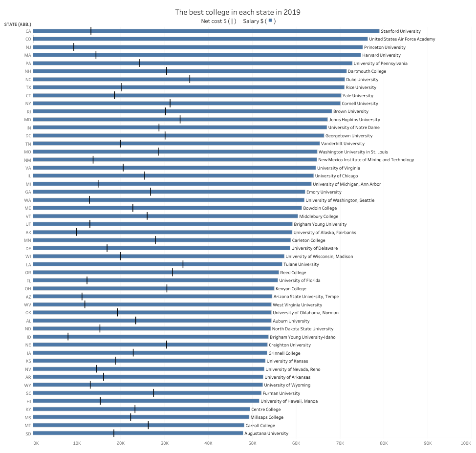
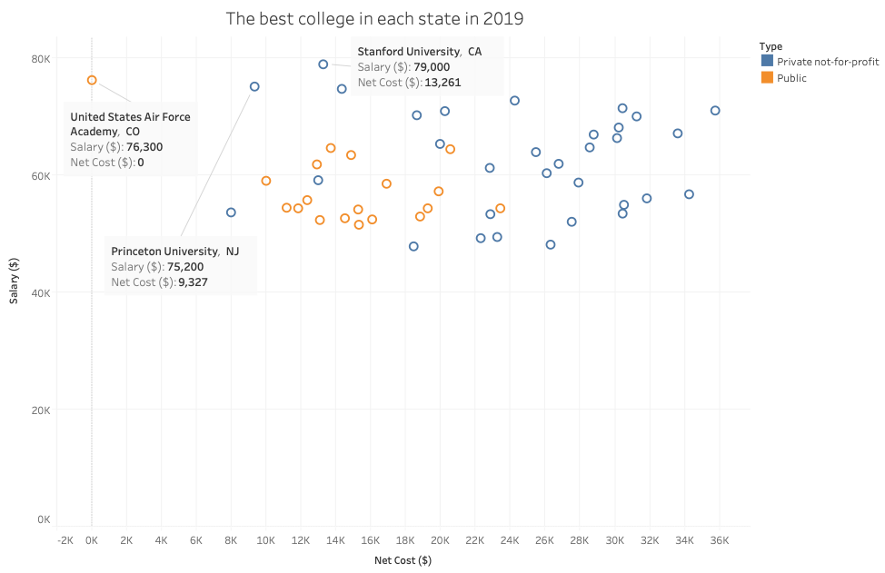
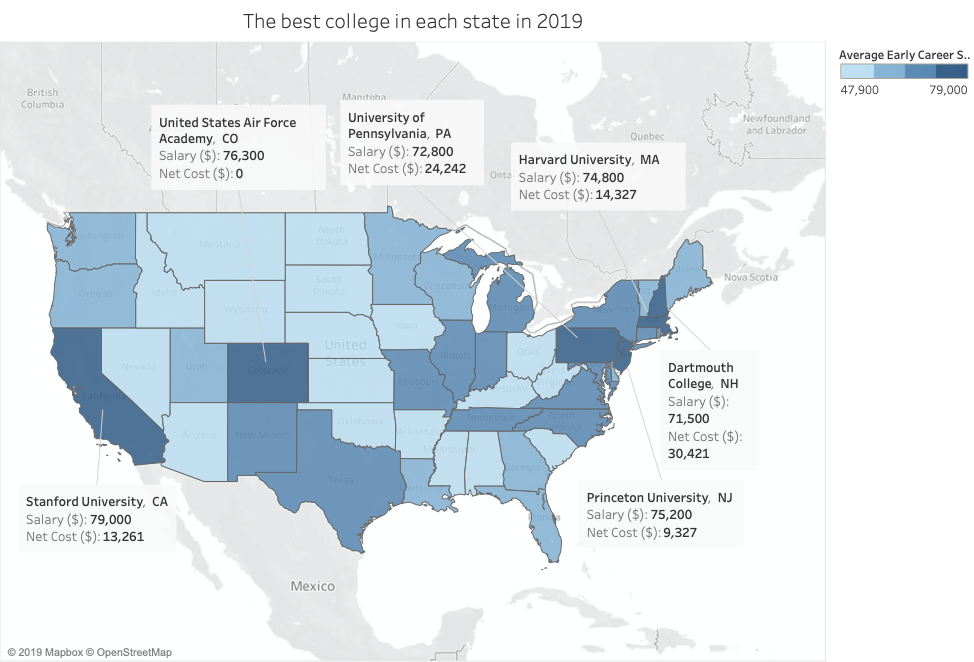

[Click here](https://howmuch.net/articles/best-college-on-each-state-2019) to see the original data visualization.

I chose this visualization because, although the image looked colorful and creative, it was difficult for me to extract information from this visualization. I could see from this visualization that there were a lot of things that can be improved, at least to make all the data clearer. 

Inspired by the critique method, I realized that the visualization was not well done in terms of usefulness, perceptibility, and intuitiveness. It did not allow people to easily compare data to generate useful insights. The colors used for classification were too close. Using the school's school badge to indicate the name of the school made the information unclear. According to the critique method, I think this type of graph may not be appropriate in this data visualization. The audience for this chart was likely to be some students or parents who needed to choose a school. They preferred to see comparisons among schools. Thus, if I would redesign this visualization, I might choose simple bar chart to show the data clearly and make the data comparable. I would also display the name of the school and state to indicate which school and state the data belonged to. In addition, I would sort the bar chart to make it easier for comparison. 

The picture below was my first wireframe. I tried to use the overlapping bar charts to represent the salary and expenses of the graduates. I showed this wireframe to my friends and made some notes that needed to be changed on the graph.

I asked the following questions to my friends.
-	Can you tell me what you think this is?
    - A: The correlation between the net price and average salary?
    - B: Which school graduates can get the highest salary?
-	Can you describe to me what this is telling you?
    - Both: Those graduates from Stanford in CA got the highest salaries.
-	Is there anything you find surprising or confusing?
    - Both: U.S. Air Force Academy doesn’t require any tuition fee?
    - A: What is net price? What does the average early career salary mean?
-	Who do you think is the intended audience for this?
    - Both: Students who want to select schools.
-	Is there anything you would change or do differently?
    - A: I will show the unit of y-axis more clearly.
    - B: I might change the color.

Also, when they were doing the review, I noticed that they were both struggling with observing the x-axis. To conclude, the change I would make to the visualization were:
-	Add a clear title.
-	Change the name of the indicator to a more understandable one.
-	Show units in the axis.
-	Convert the X-axis and the Y-axis.
-	Reduce the colors.

The graph below was my first prototype of the data visualization. I followed the critique method and create this visualization to show the data in a clearer way. I used a bullet graph to show the net cost and salary simultaneously.

I also created another two visualizations as candidates.

In those two visualizations, I wanted to focus on those schools that were worthwhile since the graduates from those schools would have higher salaries. From the scatter plot, I tried to find the correlation between the cost and the salary. Unfortunately, there seemed to be no correlation. I also used color to indicate the type of the school, which could guide the audience to the insight that private schools usually had higher costs. 

I brought those visualizations and met my friend again to get more feedback on them. I asked same questions as before and here’s the summary of the feedbacks:
-	If I was a student who want to select schools, I would say the bullet graph will be more effective.
-	There was only few information on the scatter plot and the map. They were not informative.
-	I would change the color of the bullet graph to make the contrast of the colors bigger.

To conclude, I would keep the bullet graph as my chart type. And change the color of the bullet graph.

This was the final version of the visualization.

<object class='tableauViz' width='929' height='1290' style='display:none;'><param name='host_url' value='https%3A%2F%2Fprod-useast-a.online.tableau.com%2F' /> <param name='embed_code_version' value='3' /> <param name='site_root' value='&#47;t&#47;menyw' /><param name='name' value='TSWD_AS3&#47;Dashboard1' /><param name='tabs' value='no' /><param name='toolbar' value='yes' /><param name='showAppBanner' value='false' /></object>

Source: https://www.forbes.com/top-colleges/#5ddc85211987

The bullet graph showed the graduates’ salary and the net cost of the best college in each state. From the chart, we could see that the graduates from Stanford University in CA got the highest salary in US in 2019. Also, the cost of Stanford University was relatively acceptable compared to others. We could conclude that Stanford University would be a wise choice. Although the graduates from Duke University got a high average early career salary, the cost of studying at this school cannot be underestimated. When choosing a school, people should not only pay attention to the average early career salary, but also the cost of attending the school. Many people thought that the higher the salary of graduates, the higher the cost. However, through this visualization, we cannot make such a conclusion. For example, U.S. Air Force Academy, which ranks second in salary, allowed graduates to get high pay without spending any money.

The reason why I used bullet graph was that bullet graph seemed to be a simple chart that everyone was familiar with. It would be much easier for students and parents to get information from the visualization. Because it was much like a bar chart, it was easy to understand, but it had more information than a bar chart. In general, the bullet graph was a simple and informative chart. In addition, bullet graph could enable the audience to compare among the schools using both the costs and salaries.

My visualization was completely different from the original one. Since I knew that the audience of this chart would be those students and parents who were selecting schools, I attempted to give them more useful information on this chart. In the original chart, audience could hardly make the comparison among schools. In my chart, they could not only see the comparison, but also see the ratio between net cost and salary, which could help those audiences who care about school expenses to choose the school more wisely.

