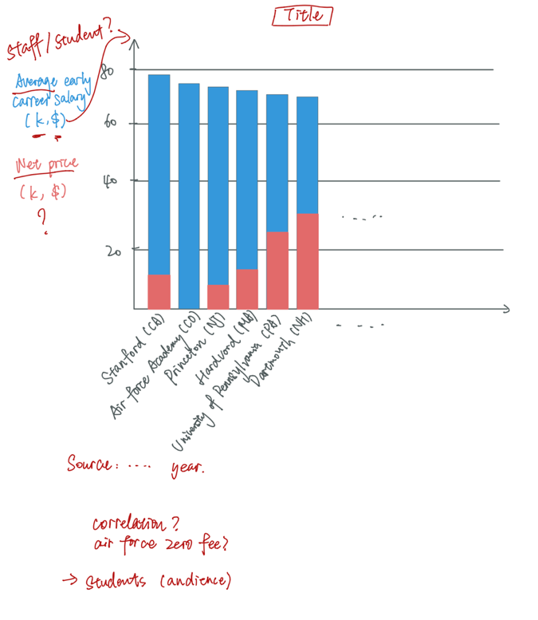

[Click here](https://howmuch.net/articles/best-college-on-each-state-2019) to see the original data visualization.

I chose this visualization because, although the image looked colorful and creative, it was difficult for me to extract information from this visualization. I could see from this visualization that there were a lot of things that can be improved, at least to make all the data clearer. 

Inspired by the critique method, I realized that the visualization was not well done in terms of usefulness, perceptibility, and intuitiveness. It did not allow people to easily compare data to generate useful insights. The colors used for classification were too close. Using the school's school badge to indicate the name of the school made the information unclear. According to the critique method, I think this type of graph may not be appropriate in this data visualization. The audience for this chart was likely to be some students or parents who needed to choose a school. They preferred to see comparisons among schools. Thus, if I would redesign this visualization, I might choose simple bar chart to show the data clearly and make the data comparable. I would also display the name of the school and state to indicate which school and state the data belonged to. In addition, I would sort the bar chart to make it easier for comparison. 

The picture below was my first wireframe. I tried to use the overlapping histograms to represent the salary and expenses of the graduates. I showed this wireframe to my friends and made some notes that needed to be changed on the graph.

